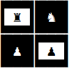



# Chess 

[](https://ci.appveyor.com/project/junioro/chess/branch/master)
[](https://travis-ci.org/jroliveira/chess)
[](https://coveralls.io/github/jroliveira/chess?branch=master)

Chess game built in C# and ASCII art.

## Installing / Getting started

Before running the application you need to perform the steps below:

 - [Installing the DejaVu Sans Mono font in Windows 10](#installing-the-dejavu-sans-mono-font-in-windows-10)
 - [Setting up Dev](#setting-up-dev)

After performing the previous steps, open a new a new **Command Prompt**.

```bash
# Run silo project
$ dotnet run --project src/Chess.SiloHost/
```

After the message `Press Enter to terminate...` appears, open a new **Command Prompt**.

```bash
# Run client project
$ dotnet run --project src/Chess.Client/
```

## Developing

### Built With

 - [.NET Core](https://docs.microsoft.com/en-us/dotnet/core/)
 - [C#](https://docs.microsoft.com/en-us/dotnet/csharp/)
 - [Orleans](https://github.com/dotnet/orleans)
 - [ReactiveX](https://github.com/dotnet/reactive)

### Prerequisites

#### Installing the DejaVu Sans Mono font in Windows 10

This font allows you to display the chess pieces in the Windows console, to install we will follow the steps below:

 - Download the **dejavu-fonts-ttf-2.37.zip** from the site [dejavu-fonts.org](https://dejavu-fonts.github.io/Download.html).
 - Extract the downloaded .zip file and install the **DejaVuSansMono.ttf** font that is in the **ttf** folder.
 - Open **regedit** go to `HKEY_LOCAL_MACHINE\SOFTWARE\Microsoft\Windows NT\CurrentVersion\Console\TrueTypeFont`.
 - Add a new **String Value** `000` with the value `DejaVu Sans Mono`.

### Setting up Dev

```bash
# Clone this repository
$ git clone https://github.com/jroliveira/chess.git

# Go into the repository
$ cd chess

# Restore dependencies
$ dotnet restore
```

### Building

```bash
# Build project
$ dotnet build

# Run all tests
$ dotnet test -v q
```

## Licensing

The code is available under the [MIT license](LICENSE).
