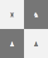

# Chess 

[](https://ci.appveyor.com/project/junioro/chess/branch/master)
[](https://travis-ci.org/jroliveira/chess)
[](https://coveralls.io/github/jroliveira/chess?branch=master)
[](https://www.codefactor.io/repository/github/jroliveira/chess)
[](LICENSE)

Chess game built in C# and ASCII art.

## Developing

### Built With

 - [.NET Core](https://docs.microsoft.com/en-us/dotnet/core/)
 - [C#](https://docs.microsoft.com/en-us/dotnet/csharp/)
 - [Orleans](https://github.com/dotnet/orleans)
 - [ReactiveX](https://github.com/dotnet/reactive)

### Pre requisites

Download and install:

 - [.NET Core SDK](https://www.microsoft.com/net/download)
 - [Node.js](https://nodejs.org/en/download/)

#### Installing the DejaVu Sans Mono font in Windows 10

This font allows you to display the chess pieces in the Windows console, to install we will follow the steps below:

 - Download the **dejavu-fonts-ttf-2.37.zip** from the site [dejavu-fonts.org](https://dejavu-fonts.github.io/Download.html).
 - Extract the downloaded .zip file and install the **DejaVuSansMono.ttf** font that is in the **ttf** folder.
 - Open **regedit** go to `HKEY_LOCAL_MACHINE\SOFTWARE\Microsoft\Windows NT\CurrentVersion\Console\TrueTypeFont`.
 - Add a new **String Value** `000` with the value `DejaVu Sans Mono`.

### Setting up Dev

```bash
# Clone this repository
$ git clone https://github.com/jroliveira/chess.git

# Go into the repository
$ cd chess

# Download node packages and install Cake
$ npm install
```

### Building

```bash
$ dotnet cake
```

### Running

```bash
$ dotnet cake --target=Start
```

## Licensing

The code is available under the [MIT license](LICENSE.txt).
